# Systematic Literature Review of Automation and Artificial Intelligence in Usability Issue Detection.

## About

This repository contains the official materials for the research paper *"Systematic Literature Review of Automation and Artificial Intelligence in Usability Issue Detection."*. The paper explores automated methods for detecting usability issues, offering a systematic literature review of studies published between 2014 and 2024. It highlights various research areas, methodologies, the use of artificial intelligence, and the use of real participants across these publications.

### Paper citation

Not published yet.

### Contents

* [Data](#data)
* [Extended results](#extended-results)
* [Authors](#authors)
* [License](#license)

## Data

[Final dataset](./data/dataset.csv) of publication sources contains 155 research publications, bibliographic data and relevant extracted data fields:
- *title*: The full title of the research publication.
- *author*: The names of the authors who contributed to the publication.
- *year*: The year the publication was released.
- *type*: The category of the publication, either journalArticle or conferencePaper.
- *volume*: The volume number in which the publication appears, if available.
- *issue*: The issue number within the journal or conference proceedings, if available.
- *pages*: The page range within the journal or conference proceedings where the publication can be found, if available.
- *venue*: The name of the journal or conference where the publication was presented or published.
- *venueShort*: The abbreviation of the conference name.
- *publisher*: The name of the publisher responsible for the publication.
- *doi*: The Digital Object Identifier (DOI), a unique identifier for the publication.
- *url*: The URL link to the publication or the publisher's webpage.
- *abstract*: A brief summary of the publication's content.
- *keywords*: The key terms that describe the main topics or themes of the publication.
- *citedBy*: The number of times the publication has been cited by other works.
- *citedByPerYear*: The average number of citations the publication receives per year.
- *quality*: Publication's quality, according to journal quartiles of conference rankings.
- *objective*: The specific research objective or domain the publication pertains to.
- *technology*: The technology or tools or utilized in the publication.
- *data*: Information about the type or source of data used in the research.
- *participants*: Whether real participants are involved in the research (yes/no).
- *maturity*: The maturity level of the research or technology discussed (concept, prototype, tool).
- *device*: The specific device or equipment used in the research.

## Extended results

Extended results provide additional charts (Figures 1-13) and abstract/keyword visualizations (Figures 14-16) that weren’t included in the article.

### Charts

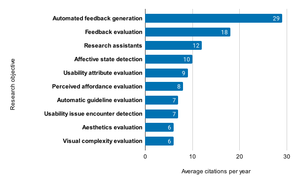\
Figure 1: Average per-year citations or research objectives.

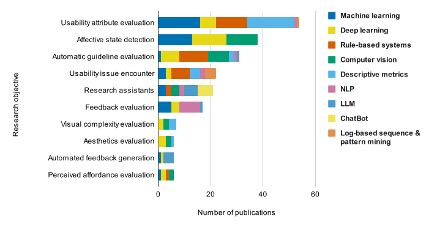\
Figure 2: Proportion of technologies across research objectives.

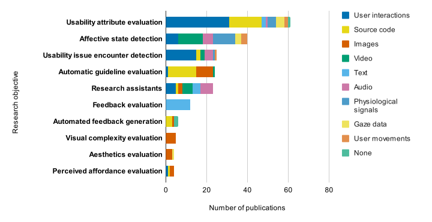\
Figure: 3 Proportion of data sources across research objectives.

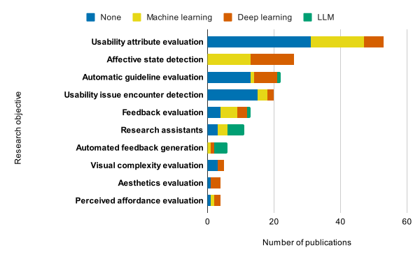\
Figure 4: Proportion of AI technologies across research objectives.

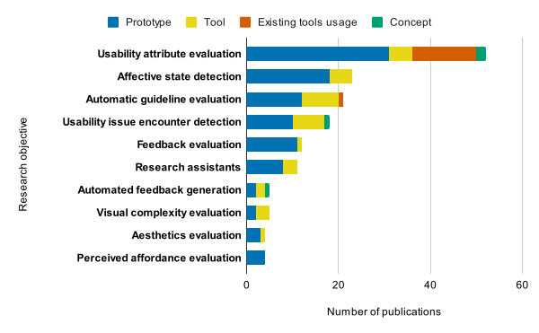\
Figure 5: Proportion of solution maturity across research objectives.

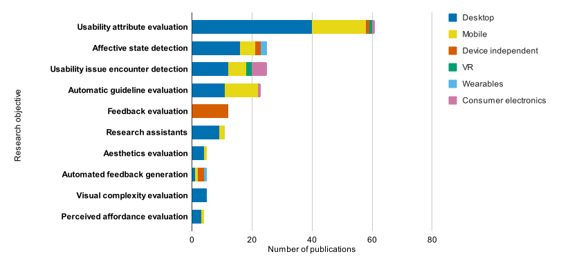\
Figure 6: Proportion of utilized devices across research objectives.

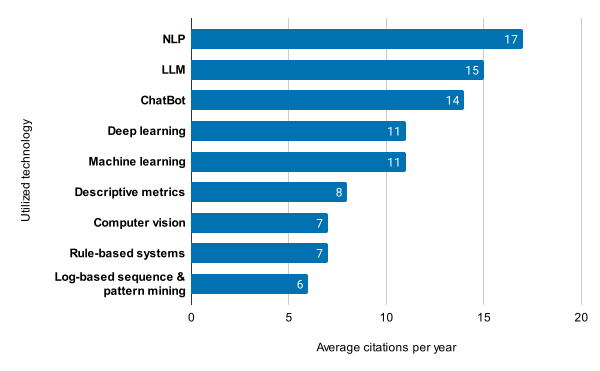\
Figure 7: Average per-year citations or used technologies.

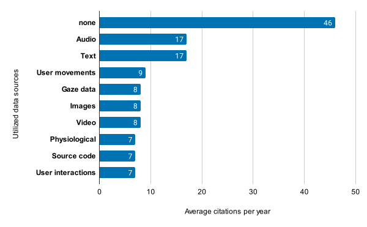\
Figure 8: Average per-year citations or used data sources.

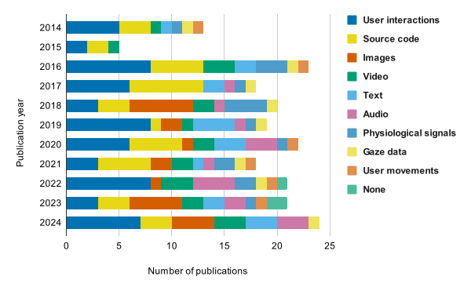\
Figure 9: Data sources across years.

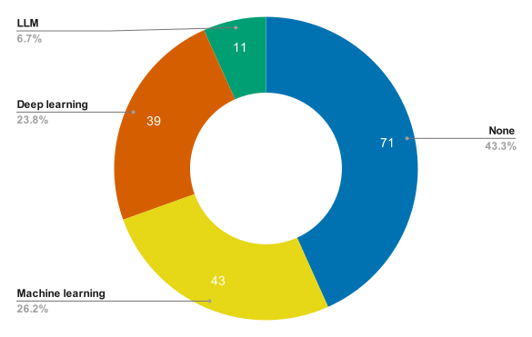\
Figure 10: Proiportions of used AI technologies.

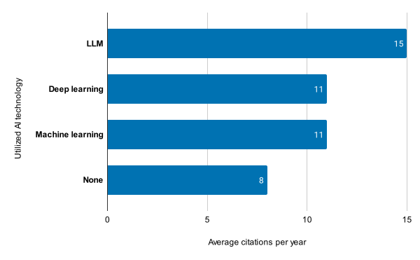\
Figure 11: Average per-year citations or used AI technologies.

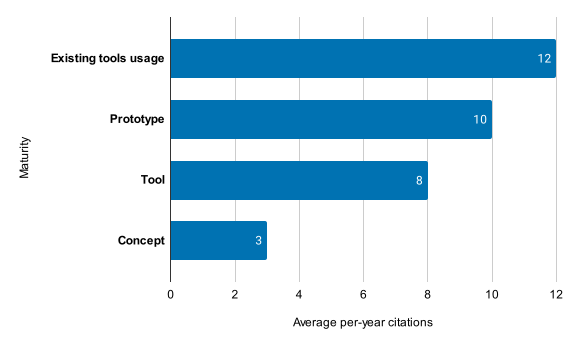\
Figure 12: Average per-year citations or solution maturity.

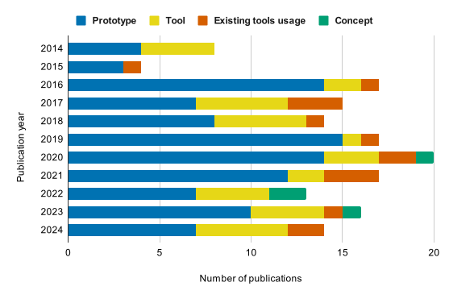\
Figure 13: Solution maturity across years.

### Abstract and keywords

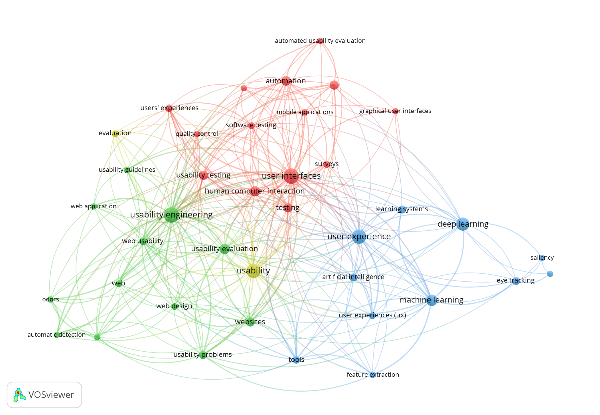
Figure 14: Keyword clusters made from publication keywords. [VOSviewer](https://www.vosviewer.com/) was utilized.

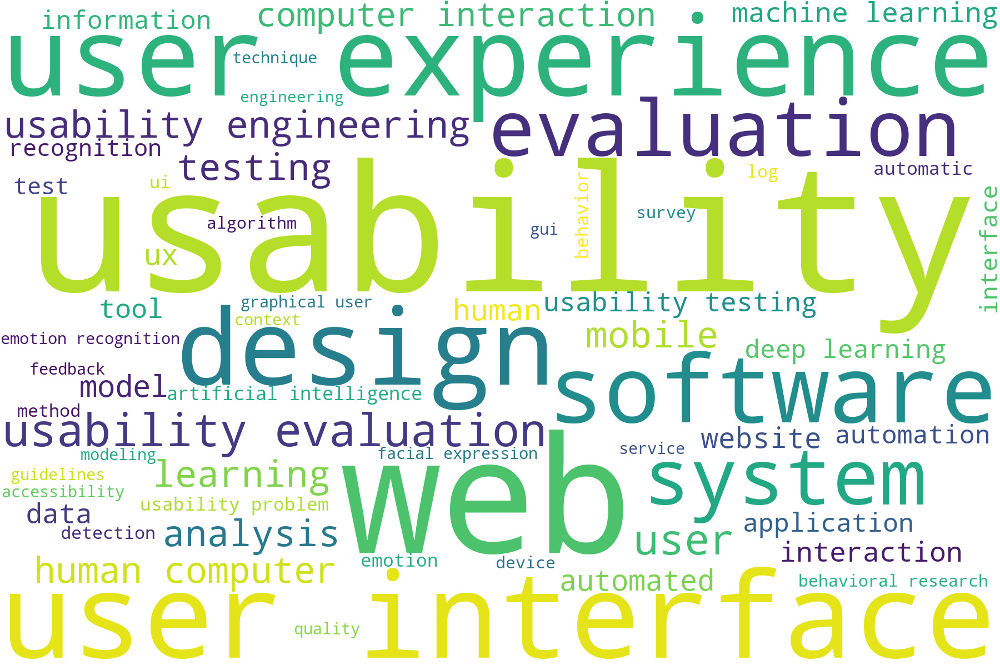
Figure 15: Keyword cloud made from publication keywords.

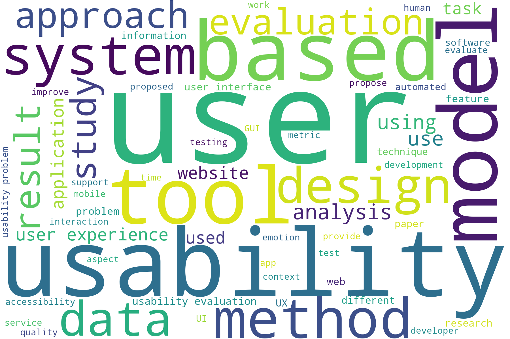
Figure 16: Keyword cloud made from publication abstracts.

## Authors

### General contact 

Email: 
**usability.ai.research@gmail.com**

**Eduard Kuric**\
He is a researcher and lecturer at [Faculty of Informatics and Information Technologies](https://www.fiit.stuba.sk/), [Slovak University of Technology in Bratislava](https://www.stuba.sk/). His research interests include human-computer interaction analysis, user modeling, personalized web-based systems, and machine learning. Eduard is also the head of the UX Research Department and the founder of [UXtweak](https://www.uxtweak.com/).
- [LinkedIn](https://www.linkedin.com/in/eduard-kuric-b7141280/)
- [Google Scholar](https://scholar.google.com/citations?user=MwjpNoAAAAAJ&hl=en&oi=ao)
- Email: eduard.kuric([AT])stuba.sk

**Peter Demcak**\
Researcher with background in software engineering, whose current topics of interest involve user behavior, human-computer interaction, UX research methods and design practices, and machine learning. Currently occupies the position of a scientific and user experience researcher at [UXtweak](https://www.uxtweak.com/), with focus on research that supports work of UX professionals.

- Email: peter.demcak([AT])uxtweak.com

**Matus Krajcovic**\
User experience researcher at [UXtweak](https://www.uxtweak.com/) and PhD student in computer science at [Faculty of Informatics and Information Technologies](https://www.fiit.stuba.sk/), [Slovak University of Technology in Bratislava](https://www.stuba.sk/). Currently focuses on data analysis and research in machine learning use in the field of human-computer interaction.
- Email: matus.krajcovic([AT])uxtweak.com

**Jan Lang**\
He is an associate professor, teacher and researcher at I[Faculty of Informatics and Information Technologies](https://www.fiit.stuba.sk/), [Slovak University of Technology in Bratislava](https://www.stuba.sk/). His research interests involve object-oriented analysis and design, software engineering, complex event processing, educational content specification and modelling, learning management and content management.

- Email: jan.lang([AT])stuba.sk

## License
This work is licensed under a [Creative Commons Attribution-NonCommercial 4.0 International License](http://creativecommons.org/licenses/by-nc/4.0/).

